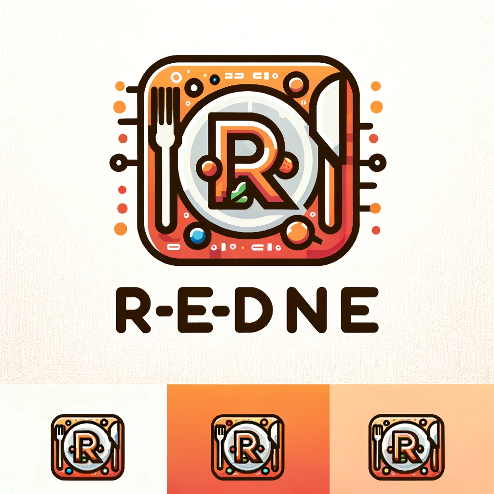

5. # R-E-Dine

    LOGO-DEMO-1

    

    LOGO-DEMO-2

    

    LOGO-DEMO-3

    

    

    餐厅预订与外卖系统示例项目

    中文/[English](README.md)

    使用 **Node.js** v20.8.1 & **Electron** 26.4.0 搭建

    使用方法：

    1. Clone 这个仓库：

        ```bash
        git clone git@github.com:1324151534/R-E-Dine.git
        ```

    2. 安装 **nodejs**:
        1. [nodejs 官网](https://nodejs.org/zh-cn)	(20.8.1)

        2. 更换 **npm** 镜像源（一次执行永久改变）:

            ```bash
            npm config set registry https://registry.npmmirror.com
            ```

            或者使用**淘宝**定制的 **cnpm** 工具:

            ```bash
            npm install -g cnpm --registry=https://registry.npmmirror.com
            ```

    3. 下载 **electron**: 

        要注意以下的 npm install / cnpm install 可能需要管理员权限

        ```bash 
        # 先进入工作目录
        cd workfolder
        # 使用 npm 工具安装 electron
        npm install --save-dev electron
        # 或者使用 cnpm
        cnpm install --save-dev electron
        ```

    5. 运行项目

        ```bash
        npm start
        ```

    6. 排错